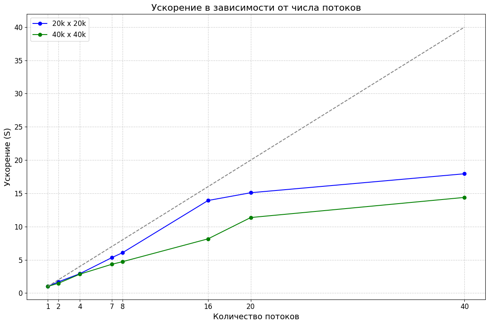

# Описание вычислительного узла:
Server name: ProLiant XL270d Gen10
Model name: Intel(R) Xeon(R) Gold 6248 CPU @ 2.50GHz
CPU(s): 80
CPU max MHz: 3900.0000
CPU min MHz: 1000.0000
Available: 2 nodes (0-1)
numa 0 cpus: 0-59
node 0 size: 385636 MB
node 0 free: 167345 MB
numa 1 cpus: 20-79
node 1 size: 387008 MB
node 1 free: 349785 MB
OS: Ubuntu 22.04.5 LTS
CODENAME: jammy
ID_LIKE : Debian

# Отчет по Заданию 1:

### 20000:

| T1  | S1  | T2   | S2   | T4   | S4   | T7   | S7    | T8   | S8    | T16  | S16   | T20  | S20   | T40  | S40   |
|-----|-----|------|------|------|------|------|-------|------|-------|------|-------|------|-------|------|-------|
| ~1.1 | 1   | ~0.8  | 1.375| ~0.28 | 5.5  | ~0.16 | 6.875 | ~0.14 | 7.85  | ~0.07 | 15.7  | ~0.05 | 22    | ~0.03 | 36.6 |

### 40000:
| T1  | S1  | T2   | S2   | T4   | S4   | T7   | S7    | T8   | S8    | T16  | S16   | T20  | S20   | T40  | S40   |
|-----|-----|------|------|------|------|------|-------|------|-------|------|-------|------|-------|------|-------|
|~4.39 |1|~2.5 |1.756| ~1.7|2,5| ~0.9 |4.8|~0.6 |7.31| ~0.29|15.1|~0.24|18,2|~0.14|31.3|

# Отчет по заданию 2
| T1  | S1  | T2   | S2   | T4   | S4   | T7   | S7    | T8   | S8    | T16  | S16   | T20  | S20   | T40  | S40   |
|-----|-----|------|------|------|------|------|-------|------|-------|------|-------|------|-------|------|-------|
|~0.47|1|~0.247|1.9|~0.13|3.61|~0.0809|5.809|~0.074|6.35|~0.0416|11.29|~0.0364|12.91|~0.0325|14.461|

# Отчет по заданию 3

N = 10000

MaxIter = 10000

Eps = 1e-5

t = 1.5

### 1 Вариант

| T1  | S1  | T2   | S2   | T4   | S4   | T7   | S7    | T8   | S8    | T16  | S16   | T20  | S20   | T40  | S40   |
|-----|-----|------|------|------|------|------|-------|------|-------|------|-------|------|-------|------|-------|
|~53.916|1|~28.3103|1.904|~16.8303|3.203|~8.4521|6.379|~7.45906|7.22|~3.72083|14.4903|~3.00962|17.914|~2.11936|25.439|

### 2 Вариант

| T1  | S1  | T2   | S2   | T4   | S4   | T7   | S7    | T8   | S8    | T16  | S16   | T20  | S20   | T40  | S40   |
|-----|-----|------|------|------|------|------|-------|------|-------|------|-------|------|-------|------|-------|
|~54.3133|1|~27.8923|1.947|~14.3801|3.776|~8.2386|6.592|~7.36419|7.375|~3.72208|14.592|~2.99563|18.1308|~1.83907|29.533|

