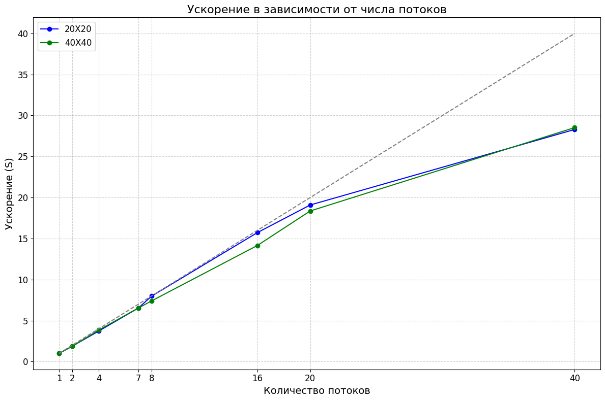

# Описание вычислительного узла:
Server name: ProLiant XL270d Gen10  
Model name: Intel(R) Xeon(R) Gold 6248 CPU @ 2.50GHz  
CPU(s): 80  
CPU max MHz: 3900.0000  
CPU min MHz: 1000.0000  
Available: 2 nodes (0-1)  
numa 0 cpus: 0-59  
node 0 size: 385636 MB  
node 0 free: 167345 MB  
numa 1 cpus: 20-79  
node 1 size: 387008 MB  
node 1 free: 349785 MB  
OS: Ubuntu 22.04.5 LTS  
CODENAME: jammy  
ID_LIKE : Debian  

# Отчет по Заданию 1:

### 20000:

| T1  | S1  | T2   | S2   | T4   | S4   | T7   | S7    | T8   | S8    | T16  | S16   | T20  | S20   | T40  | S40   |
|-----|-----|------|------|------|------|------|-------|------|-------|------|-------|------|-------|------|-------|
|~21.7902|1|~11.56|1.88|~5.854|3.72|~3.3356|6.53|~2.73|7.98|~1.3286|15.72|~1.1486|19.09|~0.77|28.29|

### 40000:
| T1  | S1  | T2   | S2   | T4   | S4   | T7   | S7    | T8   | S8    | T16  | S16   | T20  | S20   | T40  | S40   |
|-----|-----|------|------|------|------|------|-------|------|-------|------|-------|------|-------|------|-------|
|~85.744|1|~43.2712|1.87|~21.7842|3.84|~12.516|6.53|~11.44|7.4|~5.7537|14.151|~4.6405|18.36|~3.006|28.52|

